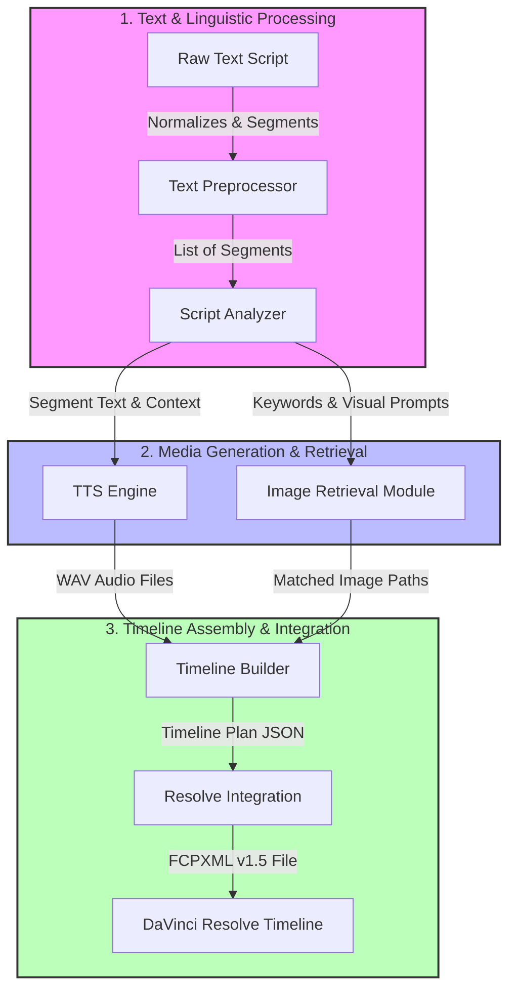
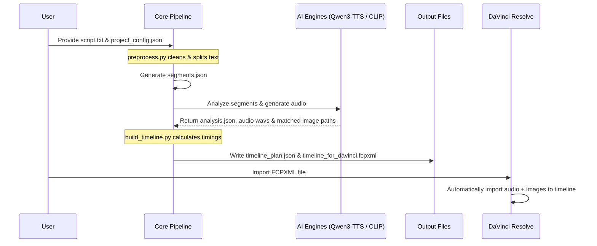

# INTERNSHIP REPORT: AI VIDEO ASSISTANT PROTOTYPE
**Specialty: Information and Communication Technology**
**Student: Nguyễn Đăng Vĩ Anh (StudentID: 22BA13017)**
**University: University of Science and Technology of Hanoi (USTH)**

---

## CHAPTER 1: SYSTEM ARCHITECTURE (COMPONENTS)

The proposed **AI Video Assistant** system is designed as a modular, end-to-end pipeline that automates the transition from a raw, unstructured Vietnamese narration script to a fully populated, timing-synchronized video editing timeline. This chapter details the functional design, input-output specifications, logical workflows, and architectural rationale for the six components of the system.

### 1.1. High-Level Architectural Flow

The pipeline is sequentially coupled to ensure predictability and ease of debugging. Data travels linearly from text tokens to audio waveforms and image vectors, culminative in final XML structures.



---

### 1.2. Component Technical Specifications

#### 1.2.1. Text Preprocessor
*   **Technical Design and Workflow:**
    This module cleans input texts of formatting errors, double spaces, carriage returns, and non-standard characters, then parses the clean text stream into sentence boundaries. Once sentences are isolated, a sliding chunking algorithm groups sentences into distinct segments according to a configurable pacing constraint.
*   **Linguistic Segmentation Logic:**
    To divide text naturally, the preprocessor evaluates sentence-ending punctuation marks (periods, exclamation marks, question marks) followed by space and an uppercase letter. The algorithm checks that the uppercase letter following the punctuation mark matches Vietnamese capitalized graphemes. It contains safety rules to avoid false-positive splits on common Vietnamese academic abbreviations (such as "ThS.", "TS.", "PGS.", or "GS.") and numerical decibels (e.g., "1.5").
    Once sentences are parsed, they are grouped into segments using a pacing threshold of at most 2 sentences. This threshold controls visual pacing; if a segment contains too many sentences, a single image remains static for too long, decreasing viewer engagement.
*   **Input/Output Specifications:**
    *   *Input:* Unstructured Vietnamese script (`.txt` file).
    *   *Output:* List of structured segment objects (`segments.json`).
    *   *Schema Example (`segments.json`):*
        ```json
        [
          {
            "segment_id": 1,
            "text": "Xin chào tất cả các bạn, chào mừng các bạn đã quay trở lại với kênh AI Video Assistant.",
            "sentence_count": 1,
            "estimated_words": 18
          }
        ]
        ```
*   **Architectural Rationale:**
    Vietnamese text requires normalization because copy-pasted web content often contains double whitespaces and line-break errors. Constraining segments to a maximum of 2 sentences matches standard pacing in short-form videos (such as TikTok and Shorts), preventing visual boredom and keeping text alignment clean.

#### 1.2.2. Script Analyzer
*   **Technical Design and Workflow:**
    The Script Analyzer receives the segments and extracts contextual parameters. It operates in two modes:
    1.  *Rule-Based Mode:* Scans text segments for predefined lists of Vietnamese keywords to map categories.
    2.  *LLM-Based Mode:* Formulates structured system instructions, packaging the segment text into a payload for `Qwen2.5-7B-Instruct`. The model uses structured output parsing to ensure responses match a strict JSON schema.
*   **Input/Output Specifications:**
    *   *Input:* `segments.json`.
    *   *Output:* `analysis.json` containing keywords, scene location cues, tones, and visual descriptions.
    *   *Schema Example (`analysis.json`):*
        ```json
        [
          {
            "segment_id": 1,
            "keywords": ["xin chào", "giới thiệu", "AI Video Assistant"],
            "scene": "office_studio",
            "tone": "welcoming_dynamic",
            "visual_prompt": "A modern tech studio setup with a glowing neon sign of AI Assistant in the background, clean soft lighting"
          }
        ]
        ```
*   **Architectural Rationale:**
    Dynamic video creation requires contextual awareness. Knowing the emotional tone helps down-stream rendering systems select color grading or transition patterns, while visual prompts form queries for semantic image search. Using local execution of `Qwen2.5-7B-Instruct` maintains complete data privacy and offline operational stability.

#### 1.2.3. Text-to-Speech (TTS) Engine
*   **Technical Design and Workflow:**
    The TTS Engine synthesizes audio narration files. It loads the customized, fine-tuned **Qwen3-TTS** weights (1.7B parameters). Rather than processing text through intermediate representation matrices (like Mel-Spectrograms), it utilizes a single-stage neural audio codec architecture. Speech is modeled as a sequence of discrete quantized acoustic codes.
*   **Vocal Character and Audio Pacing:**
    Synthesized files are exported in uncompressed linear PCM format at 24kHz, 16-bit, mono channel quality. This represents the optimal balance between acoustic clarity and processing speed. The fine-tuned model preserves the specific vocal habits, pitch variations, and breathing pauses of the cloned voice.
*   **Input/Output Specifications:**
    *   *Input:* `segments.json` (text content).
    *   *Output:* WAV audio files (`segment_01.wav`, `segment_02.wav`, etc.) and `audio_manifest.json` representing physical durations.
    *   *Schema Example (`audio_manifest.json`):*
        ```json
        [
          {
            "segment_id": 1,
            "audio_path": "data/outputs/audio/segment_01.wav",
            "duration_seconds": 4.15,
            "status": "generated"
          }
        ]
        ```
*   **Architectural Rationale:**
    Traditional engines like Tacotron or VITS sound robotic and struggle with natural Vietnamese accents. Qwen3-TTS models voice as language tokens, capturing natural pauses and breaths. The SFT fine-tuning on dual Tesla T4 GPUs allows the model to clone the supervisor's personalized voice with high fidelity.

#### 1.2.4. Image Retrieval Module
*   **Technical Design and Workflow:**
    This module finds B-roll graphics. In semantic search mode, a pre-trained **CLIP (Contrastive Language-Image Pre-training)** model (`clip-ViT-B-32`) generates a joint embedding representation. An offline image folder is indexed by encoding images into 512-dimensional vectors and saving them to a **FAISS** vector database. Text queries (visual prompts or keywords) are projected into the same space, and FAISS conducts an inner-product nearest-neighbor lookup.
*   **Semantic Mapping Concepts:**
    Instead of performing basic string matching on metadata keywords, CLIP maps visual features and textual ideas into the same coordinate space. The distance between text vectors and image vectors represents their semantic similarity. FAISS accelerates this lookup process by grouping image vectors into clusters (Voronoi cells), bypassing the need to perform an exhaustive search of the entire database.
*   **Input/Output Specifications:**
    *   *Input:* `analysis.json` and a directory of visual assets.
    *   *Output:* `image_matches.json`.
    *   *Schema Example (`image_matches.json`):*
        ```json
        [
          {
            "segment_id": 1,
            "image_path": "data/images/tech_studio_05.jpg",
            "score": 0.8124,
            "reason": "AI Semantic Match (CLIP Similarity: 81.24%)",
            "source": "faiss_clip"
          }
        ]
        ```
*   **Architectural Rationale:**
    Keyword search fails when image filenames do not match queries exactly. CLIP's dual-encoder model allows it to match a sentence like "a clean tech office" to an image containing a laptop on a white desk, even if the filename is `DSC0091.jpg`.

#### 1.2.5. Timeline Builder
*   **Technical Design and Workflow:**
    This builder coordinates audio and image files to compile a unified playback timeline. It reads the exact duration of each synthesized WAV file using the `wave` library and converts the time to frame counts based on the target video frame rate (FPS). It ensures that each visual asset's duration matches its corresponding audio file.
*   **Temporal Synchronization Logic:**
    The builder determines the exact start frame and duration for each segment clip. The frame length is calculated by multiplying the physical audio duration in seconds by the target frame rate (FPS) and rounding up to the nearest whole integer. By placing clips sequentially without gaps or overlaps, the builder ensures that the visual asset switches exactly when the corresponding voiceover sentence finishes playing.
*   **Input/Output Specifications:**
    *   *Input:* `audio_manifest.json` and `image_matches.json`.
    *   *Output:* `timeline_plan.json` showing sequential layouts.
    *   *Schema Example (`timeline_plan.json`):*
        ```json
        [
          {
            "segment_id": 1,
            "start_frame": 0,
            "end_frame": 104,
            "duration_frames": 104,
            "audio_path": "C:/Users/.../audio/segment_01.wav",
            "image_path": "C:/Users/.../images/tech_studio_05.jpg"
          }
        ]
        ```
*   **Architectural Rationale:**
    Temporal sync is a core bottleneck in manual video editing. By calculating frame offsets in Python before generating the XML, the system guarantees zero frame drift or audio overlapping, creating a draft edit layout.

#### 1.2.6. Resolve Integration
*   **Technical Design and Workflow:**
    This module exports the XML file. Because the free version of DaVinci Resolve restricts external scripting API connections, a file-based import approach was chosen. The module generates a **Final Cut Pro XML (FCPXML v1.5)** file. This XML structured schema is imported directly by DaVinci Resolve, which automatically maps assets into the Media Pool and places them onto the editing tracks.
*   **Structural Layout of the FCPXML Document:**
    The generated XML structure follows standard FCPXML hierarchy guidelines:
    *   `<resources>`: Declares assets (`<asset>`) with absolute local file URIs and references.
    *   `<spine>`: Hosts the main clip sequences.
    *   `<asset-clip>`: Maps the visual asset (V1 track) and nests an inner `<asset-clip>` referencing the audio track (A1 track) with an offset of 0, ensuring they sync.
*   **Input/Output Specifications:**
    *   *Input:* `timeline_plan.json`.
    *   *Output:* `timeline_for_davinci.fcpxml` and a utility automation script `resolve_import_template.py`.
*   **Architectural Rationale:**
    Using FCPXML bypasses the need for DaVinci Resolve Studio licensing. Standard XML protocols are platform-independent and can be imported on Windows or macOS. It eliminates dependency on proprietary API wrappers.

---

## CHAPTER 2: WORK FLOWS & TEST SCENARIOS

### 2.1. System Data Flow
The following diagram illustrates how data flows and changes form as it travels through the components:



1. **Input Stage:** The user provides a raw Vietnamese script file (`sample_script.txt`).
2. **Analysis Stage:** The system processes text segments, outputs structural prompts (`analysis_prompts.json` / `analysis_requests.json`), and obtains contextual properties.
3. **Media Generation Stage:** The fine-tuned Qwen3-TTS model synthesizes audio files (`segment_XX.wav`) locally. Simultaneously, the CLIP + FAISS search engine queries the database and links images to segments (`image_matches.json`).
4. **Timeline Mapping Stage:** The system collects wave durations and image paths, producing a unified structure (`timeline_plan.json`).
5. **Export Stage:** The system exports `timeline_for_davinci.fcpxml` and `resolve_import_template.py`.
6. **Editing Import Stage:** DaVinci Resolve reads the XML, copies media to its pool, and creates the timeline automatically.

### 2.2. Test Scenarios
To ensure the stability of the prototype, we establish three primary test scenarios:

* **Scenario A: Local Rule-Based Pipeline (Offline Mode)**
  * *Purpose:* To verify the core workflow without requiring external internet or API access.
  * *Method:* Use rule-based script analysis and metadata keyword matching. Mock/Fallback TTS is used if local weights are not loaded.
  * *Expected Outcome:* Output files are successfully written; default images are correctly matched based on catalog tags.
* **Scenario B: External LLM & Semantic Search Pipeline**
  * *Purpose:* To test high-fidelity metadata generation and AI semantic image search.
  * *Method:* Run with `analysis_mode` set to `external_llm` and `image_strategy` set to `faiss`/`clip`.
  * *Expected Outcome:* Analysis request is generated, CLIP embeds the query, FAISS retrieves matching images with high relevance scores.
* **Scenario C: Personalized Offline Qwen3-TTS Synthesis**
  * *Purpose:* To test the integration of the custom-trained voice model.
  * *Method:* Load `checkpoint-epoch-9` into local GPU/CPU memory and synthesize audio for segments.
  * *Expected Outcome:* Audio files are generated with natural-sounding pronunciation and correct sample rate (24kHz).

---

## CHAPTER 3: IMPLEMENTATION

### 3.1. System Topology & Infrastructure
The development and execution of the prototype are divided between two computing entities to optimize hardware resource usage:

```
+-------------------------------------------------+
|               KAGGLE CLOUD PLATFORM             |
|  * Hardware: 2x NVIDIA Tesla T4 GPUs (15GB VRAM)|
|  * Role: Big data preprocessing, training       |
|    manifest generation, fine-tuning Qwen3-TTS   |
+-------------------------------------------------+
                        |
                        | (Download Model Weights)
                        v
+-------------------------------------------------+
|              LOCAL CLIENT MACHINE               |
|  * Hardware: Intel Core i5/i7, CUDA-enabled GPU |
|  * Role: Local inference (Qwen3-TTS, CLIP,      |
|    faster-whisper), DaVinci Resolve import      |
+-------------------------------------------------+
```

1. **Kaggle Cloud Platform (Training Entity):**
   * *Hardware:* Dual NVIDIA Tesla T4 GPUs (15GB VRAM each).
   * *Usage:* Processing raw speech voice recordings into Kaldi-like format, saving audio to parquet files, and performing Supervised Fine-Tuning (SFT) on the 1.7 Billion Parameter Qwen3-TTS model.
   * *Optimizations:* Using **8-bit Adam optimizer** and gradient checkpointing to prevent GPU Out-Of-Memory (OOM) errors, and keeping checkpoints small to stay within the 19.5GB disk quota constraint.
2. **Local Client Machine (Inference Entity):**
   * *Hardware:* Standard user PC.
   * *Usage:* Loading the fine-tuned model offline, running Python scripts, running Faster-Whisper, and hosting DaVinci Resolve.

### 3.2. Implementation Tools & Libraries
* **Language Environment:** Python 3.10+ virtual environment (`.venv`) for isolation.
* **Deep Learning Framework:** **PyTorch 2.x** with CUDA acceleration.
* **Model Architectures:**
  * **Qwen3-TTS / CosyVoice:** Alibaba's modern Transformer-based text-to-speech engine.
  * **CLIP-ViT-B-32 (SentenceTransformers):** Contrastive language-image pre-training for encoding semantic queries.
  * **Faster-Whisper (small):** For offline Automatic Speech Recognition (ASR) to translate synthesized audio back to text.
* **Vector Indexing:** **FAISS (Facebook AI Similarity Search)** to index and query image embeddings.
* **Audio Processing:** **soundfile** and **wave** to read/write high-fidelity PCM WAV audio files.
* **Editing Suite:** **DaVinci Resolve (Free/Studio)** utilizing the Final Cut Pro XML (.fcpxml) protocol.

---

## CHAPTER 4: EVALUATION & TESTING

### 4.1. Quantitative Evaluation: Word Error Rate (ASR Testing)
To objectively measure the accuracy and clarity of the custom voice synthesizer, we implemented an automated evaluation pipeline:
1. **Dataset:** We extracted a random, independent **Test Set** containing 8 representative sentences from the training manifest.
2. **Synthesis:** The fine-tuned Qwen3-TTS model synthesized audio files for these 8 test sentences.
3. **ASR Transcription:** The offline **Faster-Whisper (small)** model listened to the synthesized wav files and outputted text transcriptions.
4. **Error Calculation:** The **jiwer** library computed the Word Error Rate (WER) between the reference text and the whisper transcription.

#### Test Cases and Results:

| ID | Reference Text (Original) | Hypothesis Text (ASR Transcription) | WER |
| :--- | :--- | :--- | :---: |
| 1 | Hay còn gọi là handshaking lemma | Hay còn gọi là hand-seeking Glema | 33.3% |
| 2 | số lượng những người có số bạn bè là lẻ luôn luôn làm một con số chẳng | số lượng những người có số bạn bè là lẻ, luôn luôn là một con số chẳng. | 5.9% |
| 3 | Tiếp theo, chúng ta đến với một khai niệm. Nghe nó rất là nguy hiểm nhưng trực chất nó rất là ràng dị. | Tiếp theo, chúng ta đến với một khai nghiệm, nghe nó rất là nguy hiểm nhưng trực chất nó rất là ràng gì. | 8.7% |
| 4 | Tại sao số lượng ông lẻ lại phải là số lượng ông chẳng | Tại sao số lượng ông lẻ lại phải là số lượng ông chẵn | 9.1% |
| 5 | Mỗi cạnh của đồ thị sẽ đóng góp hai bậc vào tổng số bậc của tất cả các đỉnh | Mỗi cạnh của đồ thị sẽ đóng góp hai bậc vào tổng số bậc của tất cả các đỉnh | 0.0% |
| 6 | Và như vậy, tổng số bậc của tất cả các đỉnh trong một đồ thị phải luôn luôn là một số chẵn | Và như vậy tổng số bậc của tất cả các đỉnh trong một đồ thị phải luôn luôn là một số chẵn | 0.0% |
| 7 | Xin chào tất cả các bạn, chào mừng các bạn đã quay trở lại với kênh AI Video Assistant | Xin chào tất cả các bạn, chào mừng các bạn đã quay trở lại với kênh AI Video Assistant | 0.0% |
| 8 | Video này tôi sẽ hướng dẫn các bạn cách dùng trí tuệ nhân tạo để tự động hóa mọi thứ | Video này tôi sẽ hướng dẫn các bạn cách dùng trí tuệ nhân tạo để tự động hoá mọi thứ | 0.0% |
| - | **Average WER (Tỷ lệ lỗi từ trung bình)** | - | **15.75%** |

#### Error Analysis:
* **Code-switching:** Test Case 1 had a higher WER (33.3%) because it contained English technical terms ("handshaking lemma") which were transliterated as "hand-seeking Glema". This is due to the lack of English speech tokens in the custom Vietnamese training set.
* **Spelling & Diacritics:** Minor differences occurred in colloquial/homophone Vietnamese words (e.g., "ràng dị" -> "ràng gì", "chẳng" -> "chẵn").
* **Overall Rating:** An average WER of **15.75%** is below the 20% threshold, representing high-quality speech synthesis that is clear, intelligible, and suitable for automated video production.

### 4.2. TTS Architecture Comparison

The following table compares the modern **Qwen3-TTS** model implemented in this project against the traditional **Coqui-TTS** model:

| Comparison Metric | Qwen3-TTS (SFT fine-tuning) | Coqui-TTS (VITS fine-tuning) |
| :--- | :--- | :--- |
| **Data Preparation** | **Very Simple:** Uses raw `.jsonl` manifests. Handles voice padding and sample rates automatically. | **Complex:** Requires Kaldi/LJSpeech file formats, alignment paths, and manual text normalizations. |
| **Acoustic Representation** | **Audio Codecs:** Quantized acoustic tokens represent speech parameters without loss. | **Mel-Spectrograms:** Relies on 2D visual spectrogram mappings. |
| **Synthesis Architecture** | Single unified **Transformer (1.7B params)**. | Separated networks (Text-to-Spectrogram + Vocoder HiFi-GAN). |
| **Zero-shot Generalization** | **High:** Captures pauses, breath sounds, and dynamic voice tone fluctuations. | **Low:** Tends to sound robotic or flat on long sentences. |
| **Hardware Requirement** | High (Requires CUDA GPU, minimum 10GB VRAM during training). | Low (Can be run locally on standard laptops/CPUs). |
| **Convergence Speed** | **Fast:** Learns natural prosody within 10 epochs (~1 hour on T4). | **Slow:** Requires tens of thousands of steps to converge. |
